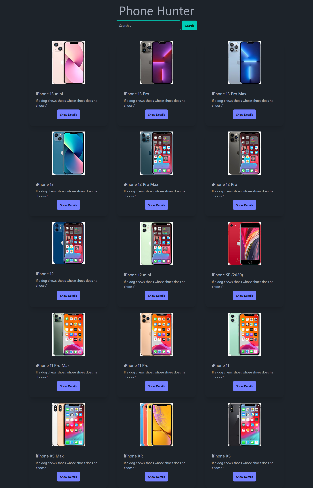

# 📱 Phone Hunter

**Phone Hunter** is a responsive single-page website where users can **search and view phone details** using a RESTful API. It’s built with **HTML**, **Tailwind CSS**, **DaisyUI**, and **JavaScript**.

[🔗 Live Demo](https://devo-ab.github.io/phone-hunter)

---

## 🛠️ Tech Stack

- **HTML5**
- **Tailwind CSS**
- **DaisyUI**
- **JavaScript (Vanilla)**
- **RESTful API** (for phone data)
---

## 🌟 Features

- 🔍 Search bar to find any phone by name  
- 📄 View phone details fetched from an external REST API  
- 📱 Responsive design for mobile, tablet, and desktop  
- ⚡ Clean UI using Tailwind and DaisyUI  

---

---

## 📁 Folder Structure

```
phone-hunter/
├── assets/
│   ├── icon/               # Logo files
├── preview/                # Screenshots for README
├── script/                 # JavaScript for area calculations
├── index.html              # Main landing page
└── README.md               # Project documentation
└── tailwind.config.js      # Tailwind config
```

---

## 🖼️ Screenshots

### 👣 Full page preview



---

## 📲 How to Use Locally

1. **Clone the repo**
   ```bash
   git clone https://github.com/devo-ab/phone-hunter.git
   cd phone-hunter
   ```

# 👤 Author

# Avi Jit

## :mailbox: Reach me out

<p align="left">
<a href="https://linkedin.com/in/itsavijitb" target="blank"></a>
<a href="https://twitter.com/itsavijitb" target="blank"></a>
<a href="https://facebook.com/itsavijitb" target="blank"></a>
<a href="https://instagram.com/itsavijitb" target="blank"></a>
</p>
